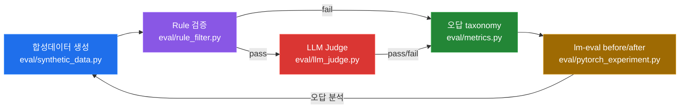

# llm-eval-pipeline

Self-Evolve loop harness — baseline evaluation and post-training evaluation infrastructure (training → re-evaluation measured in next iteration).

> **Offline / Online 경계**
>
> - **This repo (offline):** 합성데이터 생성(synthetic data), Rule 필터(rule filter), LLM Judge, 오답 taxonomy, lm-eval before/after — 품질과 학습을 오프라인에서 검증한다.
> - **Online RAG 운영:** VectorDB, LangGraph, RAGAS 기반 실시간 서빙/모니터링은 [`rag-ops-console`](https://github.com/ianlyoo/rag-ops-console)에서 담당한다.
> - 두 영역은 데이터 계약(data contract)으로만 연결되며, 이 레포는 외부 VectorDB/서빙 인프라에 의존하지 않는다.

## Pipeline

> Pipeline stages mirror an industrial Self-Evolve loop (synthesis → deterministic checks → LLM validation → error analysis → training harness).

| # | 단계 | 역할 | 모듈 |
|---|------|------|------|
| 1 | **Self-Evolve** | 오답에서 다음 학습 데이터를 만드는 자기 진화 루프 | `eval/` 전체 + `rag/pipeline.py` |
| 2 | **오답노트** | 실패 케이스를 taxonomy로 축적·분석 | `eval/metrics.py`, `eval/llm_judge.py` |
| 3 | **합성데이터** | 정답/오답·난이도·도메인 제어 합성 QA 생성 | `eval/synthetic_data.py` |
| 4 | **Rule+Judge** | 결정론적 Rule 검증 + LLM Judge 근거 충분성 판정 | `eval/rule_filter.py` + `eval/llm_judge.py` |
| 5 | **학습전후비교** | lm-eval 기반 before/after로 학습 효과 정량화 | `eval/pytorch_experiment.py` + `eval/metrics.py` |

## Pipeline Flow



흐름: **합성데이터 생성 → Rule 검증 → LLM Judge → 오답 taxonomy → lm-eval before/after** — Rule에서 탈락한 케이스와 Judge에서 근거 불충분으로 판정된 케이스 모두 taxonomy로 수집되어 다음 합성 배치의 약점 보완 제안에 반영된다. 현재 범위는 synthetic → evaluation → analysis → proposal을 닫으며, 실제 training → re-evaluation → measured improvement는 다음 iteration에서 측정한다.

## Evaluation — Measured vs Target (fail-closed honesty)

> **Measured** baseline (Deterministic Proxy): `Hit@5 0.66 / faithfulness 0.8034 / failure rate 0.34` — from `out/baseline_metrics.json` + `out/metrics_report.json` (50 samples, `proxy-expected_keyword` mode).
> **Target** after (Projected / Roadmap / Simulation, not measured): `Hit@5 Target 0.85 / faithfulness Target 0.88` — based on `eval/wrong_note.md` actions 1-2 (answer header + synonym rewrite). Not Real LLM, not Actual training result — requires v2 synthetic + `python -m eval.metrics` to become measured.
> `out/improved_metrics.json` and `out/comparison.md` are intentionally absent — `scripts/compare_rag.py` fails closed (exit 2) without two distinct measured artifacts. Do NOT treat Target as measured.

```bash
# Measured baseline repro
python -m eval.metrics
Get-Content out/metrics_report.json   # Measured 0.66 / 0.8034

# Fail-closed comparison — correctly fails until measured improved exists
python scripts/compare_rag.py --baseline out/baseline_metrics.json --improved out/improved_metrics.json
```

## Evaluation Modes

### Deterministic Proxy Judge

CI 및 offline reproducibility용 heuristic evaluator — correctness/groundedness/relevance/completeness를 token/numeric overlap으로 1-5점 채점.

### LLM-as-a-Judge

OpenAI-compatible provider (openai/featherless/grok) 기반 실제 LLM 평가 — API 키 있을 때만, prompt에 근거 포함 강제.

### Judge Agreement Experiment

API mode에서 서로 다른 judge model(A vs B)의 disagreement와 variance 비교 — `out/judge_scores.jsonl`, `out/disagreement_cases.jsonl`에 기록.

## 구조

```
llm-eval-pipeline/
├── rag/                    # 오프라인 RAG 시뮬레이션 (chunk/retrieval)
│   ├── docs_to_chunks.py   # 문서 → 청크 분할
│   └── pipeline.py         # retrieval 파이프라인
├── eval/                   # 핵심 평가 모듈
│   ├── synthetic_data.py   # 합성 QA 생성
│   ├── rule_filter.py      # 결정론적 검증
│   ├── llm_judge.py        # LLM 근거 판정
│   ├── metrics.py          # taxonomy/집계
│   └── pytorch_experiment.py # PyTorch + lm-eval 실험
├── docs/                   # 설계/리포트 문서
├── data/                   # 샘플/픽스처 (대용량 원본은 .gitignore)
├── tests/                  # pytest 스위트
├── .github/workflows/ci.yml
├── pyproject.toml
└── requirements.txt
```

## 합성 QA 생성 (Synthetic QA)

`eval/synthetic_data.py` — 문서 청크에서 `{question, reference_answer, source_chunks[], category, difficulty}` JSONL을 생성한다. **source_chunks 없이 Q/A만 생성하면 FAIL** — 모든 synthetic QA는 실제 청크에서 추출된 근거를 강제 포함한다.

- **기본 경로 (offline, API 키 불필요):** rule-based 패턴 생성 — 각 청크에서 문장·수치·절차를 추출해 질문 템플릿을 생성한다. 수치가 있는 문장 → 수치 질문, 절차 목록 → 절차 질문, 정의 문장 → 정의 질문. 템플릿 최소 6종(`numeric_fact`, `procedure`, `definition`, `policy_condition`, `sla_time`, `comparison`), 10청크 × 5질문 = 50개, 청크당 최소 3개 서로 다른 질문, 중복률 <20% (정확한 question 문자열 기준 `unique_ratio ≥ 0.8`를 코드에서 계산·검증).

```bash
python -m eval.synthetic_data --chunks data/chunks.jsonl --output data/synthetic_qa.jsonl --count 50 --seed 42
cat data/synthetic_qa.jsonl | head -5
```

- **LLM 옵션 (Featherless / Grok 실험):** `--llm-provider featherless|grok` 플래그로 OpenAI-호환 API 호출 경로를 제공한다. 프롬프트 템플릿(`LLM_PROMPT_TEMPLATE`)에 `source_chunks 근거 강제`를 명시하며, API 키(`FEATHERLESS_API_KEY` / `XAI_API_KEY`)가 없거나 호출 실패 시 자동으로 rule-based 폴백한다. README에 언급된 `Featherless/Grok` 실험은 이 옵션을 통해 재현 가능하며, 기본 CI 경로는 항상 offline rule-based로 동작한다.

```bash
# Featherless 예시 (키 있을 때만; 없으면 폴백)
FEATHERLESS_API_KEY=... python -m eval.synthetic_data --llm-provider featherless --chunks data/chunks.jsonl --output data/synthetic_qa.jsonl --count 50
# Grok (xAI) 예시
XAI_API_KEY=... python -m eval.synthetic_data --llm-provider grok --model grok-2-latest --chunks data/chunks.jsonl --output data/synthetic_qa.jsonl --count 50
```

생성된 `data/synthetic_qa.jsonl`은 rule, judge, PyTorch experiment, runtime이 그대로 consume하는 안정적인 스키마이며, 수동 검수 샘플은 `out/synthetic_qa_sample.md`에 5개 원문 + PASS/FAIL 코멘트와 중복률 로그를 포함한다.

## 설치

```bash
python -m venv .venv
# Windows: .venv\Scripts\activate
# macOS/Linux: source .venv/bin/activate
pip install -r requirements.txt
pytest -q
ruff check .
```

### Heavy deps (optional extras)

`torch`, `lm-eval`, `transformers` 등 무거운 학습/평가 의존성은 CI 경량화를 위해 `requirements.txt` core에 포함하지 않는다. 필요 시 별도 설치:

```bash
pip install torch --index-url https://download.pytorch.org/whl/cpu
pip install lm-eval==0.4.9
# 또는: pip install -e ".[eval]"
```

`pyproject.toml`의 `[project.optional-dependencies].eval` 그룹을 참조한다.

## CI

`.github/workflows/ci.yml` — `ubuntu-latest`, Python 3.11, `pip install -r requirements.txt` → `pytest -q` → `ruff check .`

## Offline / Online 상세

| 구분 | 담당 | 기술 |
|------|------|------|
| **Offline (this repo)** | 품질·학습 평가 | synthetic data, rule filter, LLM judge, taxonomy, lm-eval before/after |
| **Online (rag-ops-console)** | RAG 운영 | VectorDB, LangGraph, RAGAS, 서빙/모니터링 |

이 레포는 오프라인에서 재현 가능한 평가를 목표로 하며, 온라인 서빙 상태나 외부 VectorDB에 의존하지 않는다.

## License

MIT — see [LICENSE](LICENSE)
