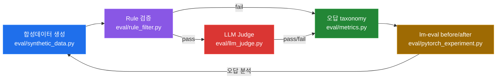

# llm-eval-pipeline

Offline 품질/학습 평가 파이프라인 — 합성데이터 생성부터 Rule 검증, LLM Judge, 오답 taxonomy, lm-eval 학습 전후 비교까지 Self-Evolve 루프를 닫는 실험 인프라.

> **Offline / Online 경계**
>
> - **This repo (offline):** 합성데이터 생성(synthetic data), Rule 필터(rule filter), LLM Judge, 오답 taxonomy, lm-eval before/after — 품질과 학습을 오프라인에서 검증한다.
> - **Online RAG 운영:** VectorDB, LangGraph, RAGAS 기반 실시간 서빙/모니터링은 [`rag-ops-console`](https://github.com/ianlyoo/rag-ops-console) (placeholder, Task 14)에서 담당한다.
> - 두 영역은 데이터 계약(data contract)으로만 연결되며, 이 레포는 외부 VectorDB/서빙 인프라에 의존하지 않는다.

## 목차 — JD 정렬

> JD 문장 그대로의 5단계 프레임으로 구성한다.

| # | 단계 | 역할 | 모듈 |
|---|------|------|------|
| 1 | **Self-Evolve** | 오답에서 다음 학습 데이터를 만드는 자기 진화 루프 | `eval/` 전체 + `rag/pipeline.py` |
| 2 | **오답노트** | 실패 케이스를 taxonomy로 축적·분석 | `eval/metrics.py`, `eval/llm_judge.py` |
| 3 | **합성데이터** | 정답/오답·난이도·도메인 제어 합성 QA 생성 | `eval/synthetic_data.py` |
| 4 | **Rule+Judge** | 결정론적 Rule 검증 + LLM Judge 근거 충분성 판정 | `eval/rule_filter.py` + `eval/llm_judge.py` |
| 5 | **학습전후비교** | lm-eval 기반 before/after로 학습 효과 정량화 | `eval/pytorch_experiment.py` + `eval/metrics.py` |

## 파이프라인 — Mermaid



흐름: **합성데이터 생성 → Rule 검증 → LLM Judge → 오답 taxonomy → lm-eval before/after** — Rule에서 탈락한 케이스와 Judge에서 근거 불충분으로 판정된 케이스 모두 taxonomy로 수집되어 다음 합성 배치의 약점 보완에 반영된다.

## 구조

```
llm-eval-pipeline/
├── rag/                    # 오프라인 RAG 시뮬레이션 (chunk/retrieval) — Tasks 9-10
│   ├── docs_to_chunks.py   # (예정) 문서 → 청크 분할
│   └── pipeline.py         # (예정) retrieval 파이프라인
├── eval/                   # 핵심 평가 모듈 — Tasks 11-13
│   ├── synthetic_data.py   # (예정) 합성 QA 생성
│   ├── rule_filter.py      # (예정) 결정론적 검증
│   ├── llm_judge.py        # (예정) LLM 근거 판정
│   ├── metrics.py          # (예정) taxonomy/집계
│   └── pytorch_experiment.py # (예정) PyTorch + lm-eval 실험
├── docs/                   # 설계/리포트 문서
├── data/                   # 샘플/픽스처 (대용량 원본은 .gitignore)
├── tests/                  # pytest 스위트
├── .github/workflows/ci.yml
├── pyproject.toml
└── requirements.txt
```

## 설치

```bash
python -m venv .venv
# Windows: .venv\Scripts\activate
# macOS/Linux: source .venv/bin/activate
pip install -r requirements.txt
pytest -q
ruff check .
```

### Heavy deps (optional extras)

`torch`, `lm-eval`, `transformers` 등 무거운 학습/평가 의존성은 CI 경량화를 위해 `requirements.txt` core에 포함하지 않는다. 필요 시 별도 설치:

```bash
pip install torch --index-url https://download.pytorch.org/whl/cpu
pip install lm-eval==0.4.9
# 또는: pip install -e ".[eval]"
```

`pyproject.toml`의 `[project.optional-dependencies].eval` 그룹을 참조한다.

## CI

`.github/workflows/ci.yml` — `ubuntu-latest`, Python 3.11, `pip install -r requirements.txt` → `pytest -q` → `ruff check .`

## Offline / Online 상세

| 구분 | 담당 | 기술 |
|------|------|------|
| **Offline (this repo)** | 품질·학습 평가 | synthetic data, rule filter, LLM judge, taxonomy, lm-eval before/after |
| **Online (rag-ops-console)** | RAG 운영 | VectorDB, LangGraph, RAGAS, 서빙/모니터링 |

이 레포는 오프라인에서 재현 가능한 평가를 목표로 하며, 온라인 서빙 상태나 외부 VectorDB에 의존하지 않는다.

## License

MIT — see [LICENSE](LICENSE)
