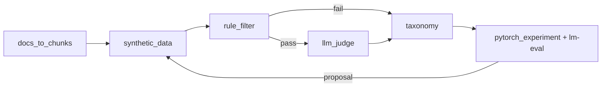

# llm-eval-pipeline

[한국어](README.ko.md)

[](https://github.com/ianlyoo/llm-eval-pipeline/actions/workflows/ci.yml)
[](LICENSE)
[](https://github.com/ianlyoo/llm-eval-pipeline/releases/tag/v0.1.0)
[](https://ianlyoo.github.io/llm-eval-pipeline/)

Offline Self-Evolve pipeline using synthetic data generation — evaluate before/after with Rule+LLM Judge and lm-eval harness in measured workloads.

> Companion repos: offline evaluation hub here, online serving at [rag-ops-console](https://github.com/ianlyoo/rag-ops-console) (VectorDB/LangGraph/RAGAS), packet generation at [signal-foundry](https://github.com/ianlyoo/signal-foundry).

## Quick start — synthetic-data and llm-evaluation with lm-eval harness

Install from tarball (deterministic, version-pinned):

```bash
gh release download v0.1.0 --pattern "*.tgz" --repo ianlyoo/llm-eval-pipeline
npm install ./llm-eval-pipeline-*.tgz
```

From source with bun (frozen lockfile):

```bash
git clone https://github.com/ianlyoo/llm-eval-pipeline.git
cd llm-eval-pipeline
bun install --frozen-lockfile
bun run build
```

Python environment (primary runtime):

```bash
python -m venv .venv
# Windows alternative: .venv\Scripts\activate
pip install -r requirements.txt
pytest -q
ruff check .
```

Generate 50 synthetic QAs and run deterministic metrics:

```bash
python -m eval.synthetic_data --chunks data/chunks.jsonl --output data/synthetic_qa.jsonl --count 50 --seed 42
python -m eval.metrics
cat out/metrics_report.json
```

## Use cases for self-evolution and offline-evaluation with pytorch

- **Self-evolution loop** — failures flow into taxonomy and inform the next synthetic batch, closing synthesis → verification → improvement proposal within one offline iteration.
- **Offline evaluation gate** — synthetic-data generation, Rule filter, LLM Judge, and harness (lm-eval) comparisons run without VectorDB or serving infra.
- **Pytorch experiment before/after** — `eval/pytorch_experiment.py` isolates training effects against the measured 50-sample baseline; projected targets become measured via re-running with a new seed.
- **Developer-tools regression** — proxy metrics (`Hit@5`, `faithfulness`) provide a fast CI check; optional LLM-backed evaluation is isolated to online repos.

## Architecture: llm-judge pipeline and data-generation pipeline

> `chunks → synthetic-data → Rule filter → LLM Judge → taxonomy → lm-eval harness`



| Stage | Module | Role |
|---|---|---|
| Synthetic data | `eval/synthetic_data.py` | 6 templates, `source_chunks` required, `unique_ratio >= 0.8`, seed 42 |
| Rule filter | `eval/rule_filter.py` | Deterministic pass/fail |
| LLM Judge | `eval/llm_judge.py` | Evidence sufficiency (OpenAI-compatible providers) |
| Taxonomy | `eval/metrics.py` | Aggregate failures, emit `out/metrics_report.json` |
| lm-eval harness | `eval/pytorch_experiment.py` | Before/after comparison harness |

`llm-eval-pipeline` owns the offline side; online RAG serving lives in `rag-ops-console`. The two share a data contract (`synthetic_qa.jsonl`) and do not duplicate evaluation code.

## Benchmark: lm-eval harness and llm-judge evaluation in measured workloads

Measured baseline (Deterministic proxy, 50 samples, seed 42, `proxy-expected_keyword` mode):

- `Hit@5 0.66`
- `faithfulness 0.8034`
- `failure rate 0.34`

Source: `out/baseline_metrics.json` and `out/metrics_report.json` (generated via `python -m eval.metrics`). Target after (`Hit@5 Target 0.85`, `faithfulness Target 0.88`) is projected and intentionally absent from `out/improved_metrics.json`.

Limitations adjacent to benchmark: synthetic seed 42, one run per condition, 50 samples, deterministic token-overlap proxy not LLM-backed RAGAS, no training improvement measured in this iteration, `out/improved_metrics.json` intentionally absent — `scripts/compare_rag.py` fails closed without two distinct measured artifacts, policy may change, no billing.

## Project structure

```
llm-eval-pipeline/
├── rag/                    # offline chunk/retrieval simulation
│   ├── docs_to_chunks.py
│   └── pipeline.py
├── eval/                   # synthetic_data, rule_filter, llm_judge, metrics, pytorch_experiment
├── docs/                   # design docs, Pages (index.html, report, limits)
├── data/                   # chunks/samples (large originals gitignored)
├── tests/                  # pytest suite
├── .github/workflows/ci.yml
├── pyproject.toml
└── requirements.txt
```

## Offline / Online boundary

| Scope | Repo | Responsibility |
|---|---|---|
| Offline (here) | llm-eval-pipeline | synthetic-data, rule, llm-judge, harness, taxonomy |
| Online | rag-ops-console | Chroma VectorDB, LangGraph 5 nodes, RAGAS, Sheets loop |

Data contract only — this repo does not depend on external VectorDB or serving infra.

## Reproducibility

```bash
python -m eval.metrics
python scripts/compare_rag.py --baseline out/baseline_metrics.json --improved out/improved_metrics.json
# exit 2 until improved artifact exists -- fail-closed by design
```

Heavy evaluation deps (`torch`, `lm-eval`, `transformers`) are in `[project.optional-dependencies].eval` — install separately when needed.

## License

MIT — see [LICENSE](LICENSE).
